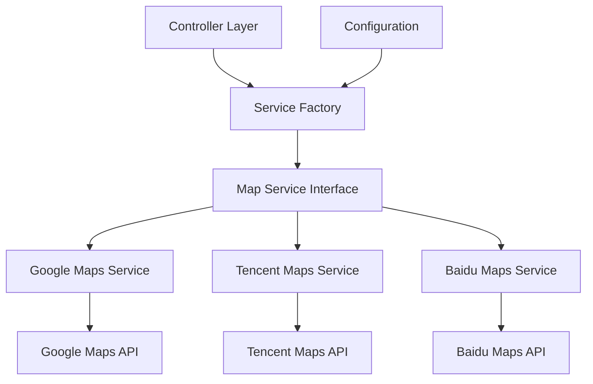

# 地理服务模块设计文档

## 1. 功能概述

地理服务模块提供统一的地理位置服务接口，支持多个地图服务提供商（Google、腾讯、百度），主要功能包括：

- **驾车距离计算**：计算两个地理坐标点之间的驾车距离
- **地址解析**：将文本地址转换为地理坐标信息，并提供详细的地址组成部分

## 2. 设计架构



### 核心组件说明

- **Controller Layer**: 提供 REST API 接口，接收客户端请求
- **Service Factory**: 根据配置动态选择地图服务提供商
- **Map Service Interface**: 统一的地图服务接口定义
- **具体实现类**: 封装不同地图服务商的 API 调用
- **Configuration**: 配置管理，支持动态切换服务提供商。

## 3. API 说明

### 3.1 驾车距离计算

```http
POST /api/distance/driving
```

请求参数：
```json
{
    "origin": {
        "lat": 39.915,
        "lng": 116.404
    },
    "destination": {
        "lat": 39.975,
        "lng": 116.458
    }
}
```

响应结果：
```json
{
    "distance": 9500,  // 单位：米
    "status": "success"
}
```

### 3.2 地址解析

```http
GET /api/geocode?address={address}
```

响应结果：
```json
{
    "status": "success",
    "results": [{
        "latitude": 39.915,
        "longitude": 116.404,
        "province": "北京市",
        "city": "北京市",
        "district": "东城区",
        "street": "王府井大街",
        "streetNumber": "1号",
        "formattedAddress": "北京市东城区王府井大街1号",
        "confidence": 0.95
    }]
}
```

## 4. 配置说明

配置文件位于 `src/main/resources/application.properties`

### 4.1 地图服务提供商配置

```properties
# 设置地图服务提供商（支持：google、tencent、baidu）
map.provider=baidu

# Google Maps 配置
map.google.api-key=your-google-api-key

# 腾讯地图配置
map.tencent.api-key=your-tencent-api-key

# 百度地图配置
map.baidu.api-key=your-baidu-api-key
```

### 4.2 其他配置项

```properties
# 默认语言设置
map.language=zh

# 服务监控配置
spring.jmx.enabled=true
spring.jmx.port=9002
```

### 4.3 配置项说明

| 配置项 | 说明 | 默认值       |
|--------|------|-----------|
| map.provider | 地图服务提供商 | google    |
| map.language | 接口返回的语言 | zh        |
| map.*.api-key | 服务商 API 密钥 | -         |
| map.*.base-url | 服务商 API 地址 | 各服务商默认地址,这里可以通用修改默认地址，实现代理服务，例如在国内无法访问 Google Maps API 时。|

**Note:**  '*' 代表  `google`, `baidu`, `tencent`

## 5. 未完成
模块以独立的 maven 项目开发， 可以独立运行。在实际项目中使用需要结成公司ad2cloud模块，实现：
1. 日志管理
2. 国际化
3. package name